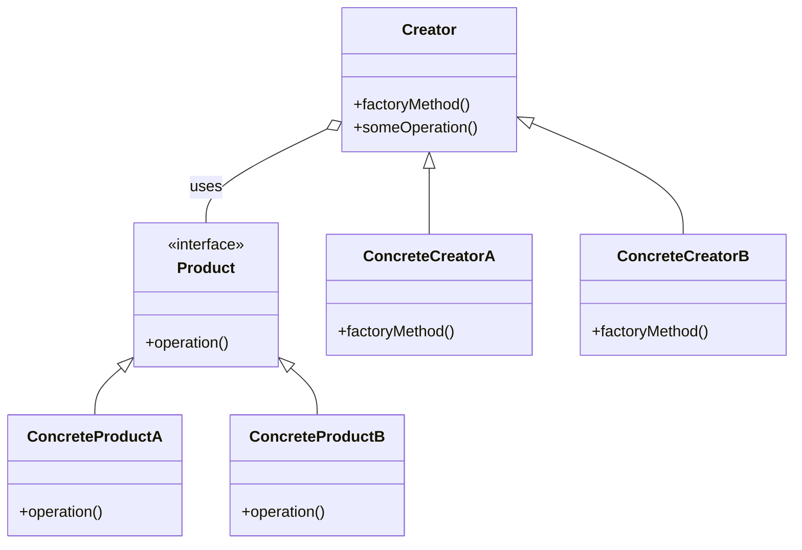

# Factory Method Pattern

## Intent

Define an interface for creating an object, but let subclasses decide which class to instantiate. The Factory Method lets a class defer instantiation to subclasses.

## Problem

Code that creates objects often depends on concrete classes. This tight coupling makes the code harder to extend and test. The Factory Method decouples object creation from usage.

## Solution

Provide a Creator class that declares the factory method returning a `Product` interface. ConcreteCreator subclasses override the factory method to return different ConcreteProduct implementations.

## Structure (UML)



> Note: The diagram above is a Mermaid class diagram. Many Markdown renderers (GitHub/GitLab with Mermaid enabled) will render it directly.

## Participants

- **Product**: declares the interface of objects the factory method returns.
- **ConcreteProduct**: implements the Product interface.
- **Creator**: declares the factory method, may also provide a default implementation that uses the product returned by the factory method.
- **ConcreteCreator**: overrides the factory method to return an instance of a ConcreteProduct.

## Collaborations

Client code works with `Creator` and `Product` abstractions. When client calls `Creator.someOperation()` it uses the `Product` returned by the factory method but remains unaware of the concrete product class.

## Consequences

- Promotes loose coupling between creator and concrete products.
- Makes it easy to introduce new products without changing existing client code.
- Can lead to many small Creator subclasses if there are many products.

## Implementation notes

- Prefer returning smart pointers (`std::unique_ptr`) in C++ to clearly express ownership.
- Keep the Creator interface small; factory methods should return abstract products only.
- Consider using registration (product registry) if client needs to instantiate products by string/ID.

## Example (C++)

A real-world runnable example demonstrating the Factory Method is provided at:

- [creational/factory/example/FactoryExample.cpp](creational/factory/example/FactoryExample.cpp#L1-L200)

This example models a notification-sending subsystem where the application selects
the concrete sender at runtime (email, SMS, push). Mapping to pattern participants:

- `NotificationFactory` : Creator
- `NotificationSender`  : Product
- `EmailSender`, `SMSSender`, `PushSender` : ConcreteProduct implementations

To extend with a new channel, implement a new `NotificationSender` and update the factory.

### Build & Run

Using `g++` (C++17):

Windows (PowerShell/Cygwin):

```powershell
& 'C:\cygwin64\bin\g++.exe' -g -std=c++17 creational/factory/example/FactoryExample.cpp -o creational/factory/example/FactoryExample.exe
.\creational\factory\example\FactoryExample.exe email
.\creational\factory\example\FactoryExample.exe sms
.\creational\factory\example\FactoryExample.exe push
```

POSIX:

```bash
g++ -g -std=c++17 creational/factory/example/FactoryExample.cpp -o FactoryExample
./FactoryExample email
./FactoryExample sms
./FactoryExample push
```

## References

- Gamma, Helm, Johnson, Vlissides — Design Patterns: Elements of Reusable Object-Oriented Software (Factory Method chapter)
